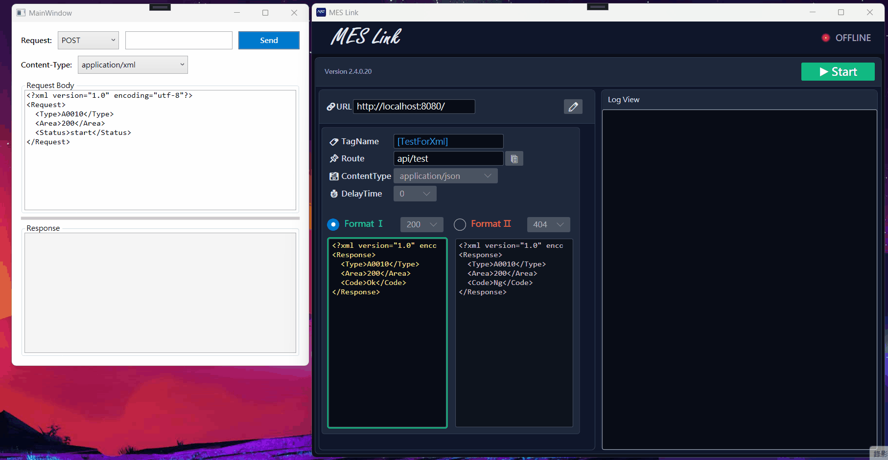
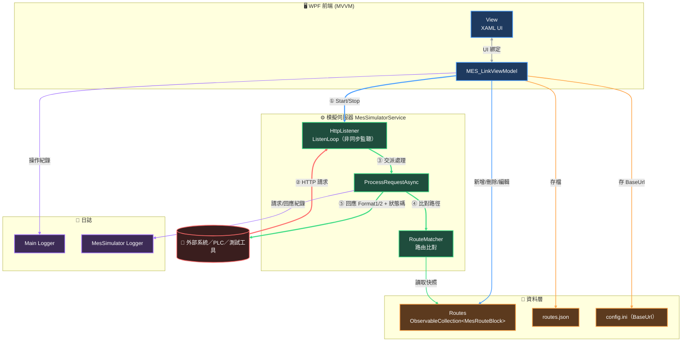

# 🏭 MES_Link｜MES API 模擬伺服器工具

這是一套 **MES模擬自動化程式**，讓工程師或客戶端無需真正的 MES 後端，就能在本機模擬出一組可自訂路由、回應內容、狀態碼與延遲的 **HTTP API**，用於設備端系統的介接測試與除錯，加速整合測試流程、降低對真實產線系統的依賴。



---

## ➣ 功能特色

- **動態路由管理**：UI 上可自由新增／刪除多組 API 路由，每組路由可獨立設定
- **雙格式回應切換**：每個路由可預設「正常／異常」兩組回應內容（Format1 / Format2），一鍵互斥切換，模擬成功與失敗情境
- **自訂 HTTP 狀態碼**：200 / 400 / 404 / 500 可選，模擬情境測試
- **延遲模擬**：可設定 0–10 秒延遲回應，測試逾時（timeout）與非同步等待邏輯
- **多種 Content-Type**：支援 JSON / XML / SOAP+XML / plain text / html 等格式
- **編輯／鎖定雙模式**：避免測試中誤改設定，切回鎖定時自動存檔
- **一鍵複製完整 URL**：BaseUrl + Route 自動組合，複製到測試工具即可用
- **雙軌日誌**：主程式日誌與模擬伺服器請求日誌分開類別記錄，方便追查問題
- **設定持久化**：路由清單存成 JSON、BaseUrl 存成 INI，重啟後自動還原
- **具備單元測試**：以 xUnit + Moq 對 ViewModel／路由邏輯進行隔離測試

---

## ➣ 技術架構

| 分類 | 技術 / 套件 | 說明 |
|---|---|---|
| 桌面框架 | **WPF (.NET)** | Windows 原生 UI 框架 |
| 設計模式 | **MVVM**、`CommunityToolkit.Mvvm` | `ObservableObject` / `RelayCommand` / `AsyncRelayCommand` |
| 依賴注入 | **建構子注入（Constructor Injection）** | `IMesSimulatorService` / `ILoggerService` / `IDialogService` 皆以介面注入 ViewModel，方便替換與測試 |
| 本機 HTTP 伺服器 | **`System.Net.HttpListener`** | 原生輕量 HTTP 服務端，不依賴外部 Web 框架 |
| 非同步請求處理 | **`async` / `await` + `Task.Run`** | `ListenLoop` 非阻塞式監聽，每筆請求丟到獨立 Task 平行處理 |
| 執行緒安全 | **`lock` + 集合快照（Snapshot）** | 讀取路由清單前先在鎖內複製一份，鎖外操作，避免長時間佔用鎖 |
| 路由比對 | **自製 `RouteMatcher`** | 純函式、大小寫不敏感比對，易於單元測試 |
| 資料格式 | **JSON**（`Newtonsoft.Json`） | 路由清單序列化存檔／讀取 |
| 設定管理 | **INI 檔 + `Microsoft.Extensions.Configuration`** | 儲存 BaseUrl 等系統設定 |
| 日誌系統 | **NLog（雙 Logger）** | `MainLogger` 與 `MesSimulatorLogger` 分開輸出到不同資料夾，Singleton 模式管理 |
| UI 元件庫 | **ModernWpf（Dark Theme）** | Fluent Design 風格控制項 |
| 單元測試 | **xUnit + Moq** | Fake / Mock 雙軌測試策略，驗證 ViewModel 指令與領域邏輯 |

---

## ➣ 系統架構圖



**圖例說明：**

| 顏色 | 意義 |
|---|---|
| 🔵 藍色 | 前端 UI 綁定 / 伺服器啟停控制 |
| 🔴 紅色 | 外部客戶端發出的 HTTP 請求 |
| 🟢 綠色 | 伺服器內部請求處理主流程 |
| 🟠 橘色 | 資料持久化（JSON / INI） |
| 🟣 紫色 | 日誌寫入 |

**請求處理流程摘要：**
1. 使用者於 UI 設定路由（URL、回應內容、狀態碼、延遲）後按下 **Start**
2. `MesSimulatorService` 以 `HttpListener` 在指定 `BaseUrl` 開始非阻塞式監聽（`ListenLoop`）
3. 每筆進來的請求都會丟進獨立 `Task`（`ProcessRequestAsync`）平行處理，避免互相阻塞
4. 依請求路徑用 `RouteMatcher` 比對清單（讀取時先在鎖內複製快照，避免長時間鎖定 UI 集合）
5. 依路由目前選擇的 Format1／Format2，回傳對應 JSON／XML 內容、狀態碼；若設有延遲則先 `await Task.Delay`
6. 找不到對應路由則回傳 `404`；請求與回應內容分別寫入 **MesSimulator 專屬 Log**

---

## ➣ 專案結構

```
MES_Link/
├── IniParser/                   # INI 設定讀寫（BaseUrl）
├── Interfaces/                  # IDialogService / ILoggerService / IMesSimulatorService
├── LogManager/                  # NLog 封裝（類別：Main / MesSimulator）
├── MainUI/
│   ├── Services/                # WpfDialogService（UI 對話框實作）
│   ├── ViewModels/              # MES_LinkViewModel（核心業務邏輯）
│   └── Views/                   # 主視窗 XAML
├── MesSimulator/
│   ├── MesRouteBlock.cs         # 單一路由的資料模型
│   ├── MesSimulatorService.cs   # HttpListener 核心邏輯（啟停、監聽、回應）
│   └── RouteMatcher.cs          # 路由比對（可獨立測試的純函式）
MES_Link.Tests/
└── Tests (單元測試)/             # xUnit + Moq 單元測試、Fake 實作
```